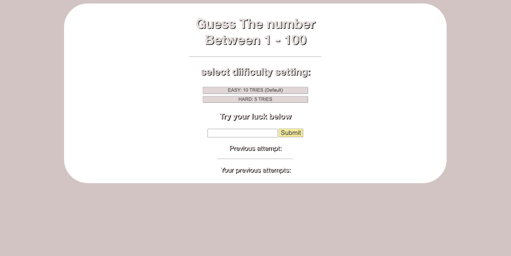
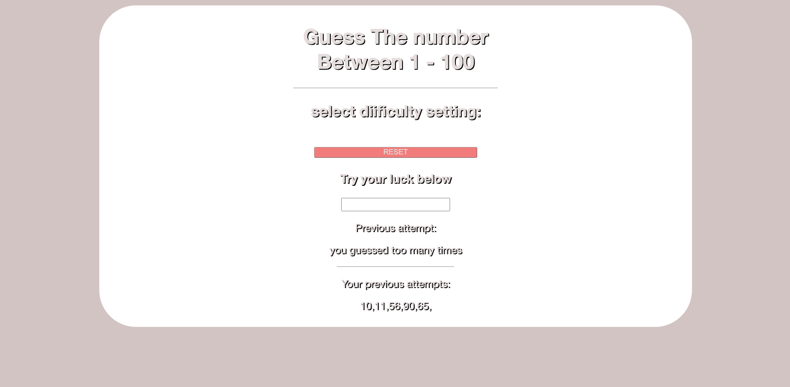
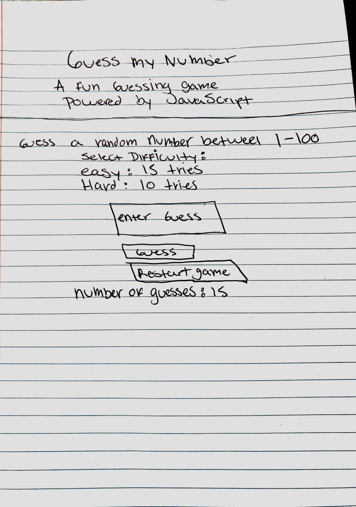
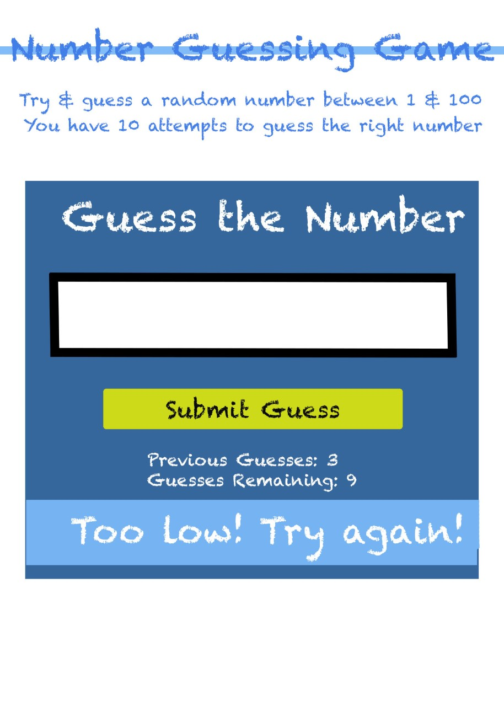
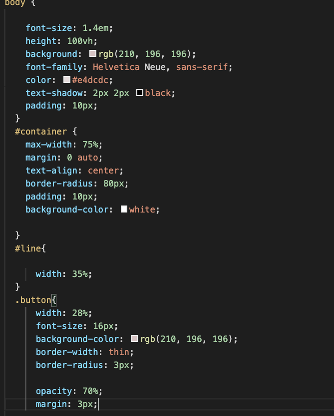
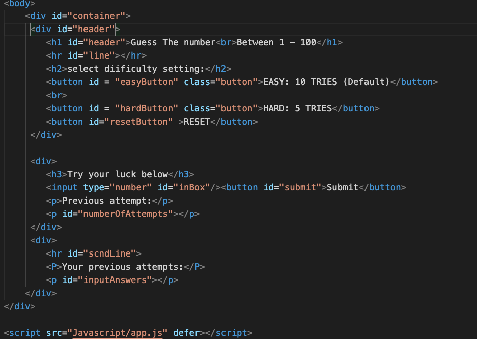
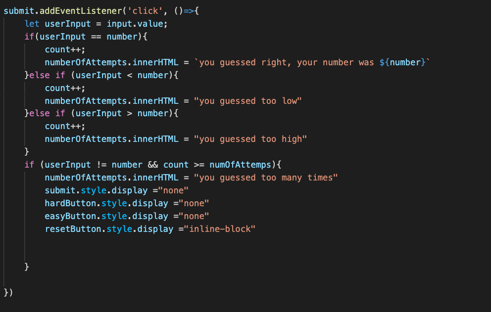

# Guess the Number
"Guess the number"

 "Guess the number" is a single player game against the computer. The player thinks of an integer within 1 and a 100. If the guess is incorrect, the computer tells the player whether the guess was to high or to low. The player has a set number of attempts at guessing the correct number. If he doesnt guess correctly within the set number of tries he loses. If the player guesses correctly he wins and moves on to the next round.

### Motivation
My motivation behind this game is to create a simple, fun, and clean game. To display my unique take on the game while expanding my understanding of HTML, CSS, and JavaScript.

---
### Screenshots

---
### User Stories & Wireframes
The planning materials used to build this app.
* High-level user stories.
* image files of wireframes
1)Player selects dificulty level
2)Player enters guess into submit box
3)if guess is to low player guesses higher
4)If player guesses to high player guesses lower
5)Once the player runs out of guesses he must hit the reset button and start over
6)If player guesses correctly, he wins and game is over

---
### Technologies & Code Snippets
* list of technologies
* screen captures of your code
1)CSS

2)HTML

3)JavaScript

---
### Credits
Give credit to any `codepen` that inspired you, `medium` article that helped you, or `stackoverflow` that pointed you in the right direction.

James Sinkler,
Nick Schmitt,
Brian Krabec,
Marisela Espinoza

---

### Future development
What are the next steps for the project? How will you continue to evolve it?

The next steps for my project are to incorporate a timer to enhance the difficulty and user expirience. In the future I would like to incorporate a function that allows the user to set their own parameters.

